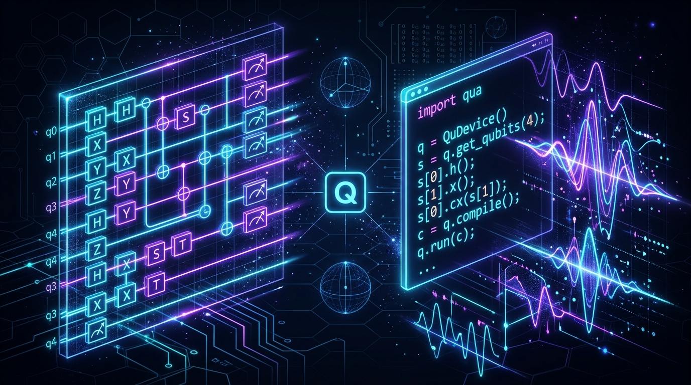
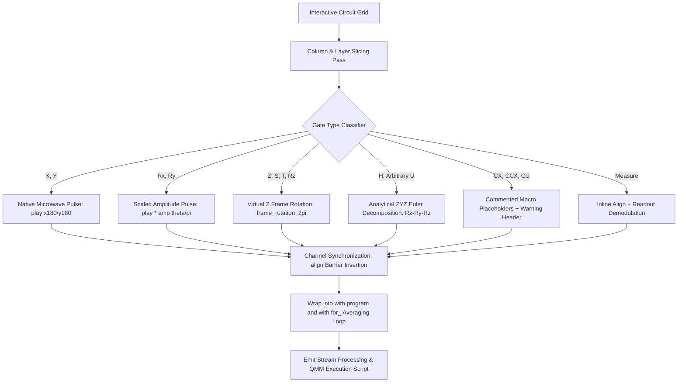

<div align="center">

  

  <br/><br/>

  <h1 align="center">
    
  </h1>

  <p align="center">
    <strong>A next-generation Quantum Circuit Composer with a high-fidelity QUA (Quantum Machines) pulse-level transpiler targeting OPX/OPX+ hardware.</strong>
  </p>

  <p align="center">
    
    
    
    
    
  </p>

  <p align="center">
    <a href="#-core-features">Features</a> •
    <a href="#-qua-compilation-pipeline">QUA Pipeline</a> •
    <a href="#-pulse--math-translation">Pulse Mappings</a> •
    <a href="#-quick-start">Quick Start</a> •
    <a href="#-architecture">Architecture</a>
  </p>

  ---
</div>

<br/>

## ⚡ Overview

The **Quantum Circuit Composer & QUA Transpiler** provides an interactive drag-and-drop circuit interface that translates abstract quantum circuit topologies directly into **runnable pulse-level QUA programs** (`.py`) for Superconducting Qubits (OPX/OPX+ controllers).

```
┌──────────────────────────────┐         ┌──────────────────────────────┐         ┌──────────────────────────────┐
│     Drag-and-Drop Circuit    │ ──────► │    Pure Client-side Compiler │ ──────► │   Runnable Physical QUA .py  │
│  [H]───[X]───[●]───[Measure] │         │  • Analytical Euler ZYZ      │         │  • play("x180", "qubit")     │
│         │     │       │      │         │  • Virtual Frame Rotations   │         │  • frame_rotation_2pi()      │
│  ───────[Y]───[X]─────┴──────│         │  • Channel Alignment         │         │  • align() + dual_demod()    │
└──────────────────────────────┘         └──────────────────────────────┘         └──────────────────────────────┘
```

---

## 🚀 Core Features

- 🎛️ **Intuitive Circuit Designer**: Visual timeline grid supporting single-qubit ($H, X, Y, Z, S, T$), parameterized ($R_x, R_y, R_z$), custom unitary ($U, CU$), multi-qubit ($CX, CCX$), and mid-circuit Measurement gates.
- ⚡ **Physical QUA Code Generation**:
  - Direct conversion to native microwave pulses (`play("x180", ...)`, `play("y180", ...)`).
  - Virtual zero-latency frame tracking (`frame_rotation_2pi(...)`).
  - Euler ZYZ decomposition for arbitrary unitaries and $H$.
  - Native amplitude scaling `play("x180" * amp(θ / π))` for parameterized rotations.
- ⏱️ **Inline Measurement & Synchronization**:
  - Sequential `align("qubit", "resonator")` $\rightarrow$ `measure()` $\rightarrow$ `assign()` $\rightarrow$ `wait()`.
  - Automatic `align("resonator", "qubit")` re-synchronization when gates follow measurement on the same wire.
  - Safe stream `save()` aggregation at the end of the averaging loop (`for_`).
- 🔧 **Hardware Configuration Selector**: Easily switch between standard and custom controller hardware configurations (`Standard IQ`, `Octave`, `LF-FEM`, `LF+MW FEM`).
- 🔄 **Smart Decomposition (`Optimise`)**:
  - Local direct decomposition for $X \rightarrow R_x(\pi)$ and $Y \rightarrow R_y(\pi)$.
  - Backend analytical unitary decomposition for complex/custom gates.
- 🔍 **Real-Time Quantum Analysis & Code Preview**: Interactive sidebar previewing OpenQASM, Qiskit Python, Circuit JSON, Dirac notation, statevectors, and QUA code with one-click copy and `.py` export.

---

## 🔬 QUA Compilation Pipeline



---

## 📐 Pulse & Math Translation

| Circuit Gate | Target Action | Generated QUA Instruction | Mechanism |
| :--- | :--- | :--- | :--- |
| **$X$** | $180^\circ$ around X | `play("x180", "qubit")` | Native pre-calibrated $X_{\pi}$ pulse |
| **$Y$** | $180^\circ$ around Y | `play("y180", "qubit")` | Native pre-calibrated $Y_{\pi}$ pulse |
| **$Z$** | $180^\circ$ around Z | `frame_rotation_2pi(0.5, "qubit")` | Virtual frame rotation ($\frac{\pi}{2\pi} = 0.5$ turns) |
| **$S$** | $90^\circ$ around Z | `frame_rotation_2pi(0.25, "qubit")` | Virtual frame rotation ($\frac{\pi/2}{2\pi} = 0.25$ turns) |
| **$T$** | $45^\circ$ around Z | `frame_rotation_2pi(0.125, "qubit")` | Virtual frame rotation ($\frac{\pi/4}{2\pi} = 0.125$ turns) |
| **$R_x(\theta)$** | Parameterized X | `play("x180" * amp(θ / π), "qubit")` | Dynamic amplitude scaling factor |
| **$R_y(\theta)$** | Parameterized Y | `play("y180" * amp(θ / π), "qubit")` | Dynamic amplitude scaling factor |
| **$R_z(\theta)$** | Parameterized Z | `frame_rotation_2pi(θ / (2π), "qubit")` | Fractional frame rotation |
| **$H$ / $U$** | Unitary Matrix | `frame_rotation_2pi(λ)`<br/>`play("y180" * amp(θ/π))`<br/>`frame_rotation_2pi(φ)` | Closed-form analytical ZYZ Euler decomposition |
| **$M$ (Measure)** | Readout | `align("qubit", "resonator")`<br/>`measure("readout", ...)` | Synchronized multi-quadrature demodulation |

---

## 🛠️ Quick Start

### 1. Clone and Install
```bash
git clone https://github.com/your-username/Quantum-Circuit-Composer.git
cd Quantum-Circuit-Composer

# Install frontend dependencies
npm install

# Set up Python backend (for AerSimulator & Unitary decomposition)
cd backend
python3 -m venv .venv
source .venv/bin/activate
pip install -r requirements.txt
cd ..
```

### 2. Run the Development Environment
```bash
# Terminal 1: Python FastAPI Simulation Server (Port 8001)
cd backend && source .venv/bin/activate && fastapi dev app/main.py --port 8001

# Terminal 2: Next.js Frontend (Port 3000)
npm run dev
```

### 3. Production Build & Run
```bash
npm run build
npm run start
```
Open **[http://localhost:3000](http://localhost:3000)** in your browser.

---

## 📂 Project Architecture

```
Quantum-Circuit-Composer/
├── public/assets/             # Static visual media & banners
├── src/
│   ├── components/
│   │   ├── CircuitEditor/     # Grid, drag-and-drop wires, gate tiles & badges
│   │   ├── Inspector/         # Quantum analysis, statevector & live QUA preview
│   │   ├── Palette/           # Draggable quantum gate drawer
│   │   ├── Toolbar/           # Hardware selector, shots, undo/redo & Dump QUA
│   │   └── ui/                # High-performance UI components & CodeViewer
│   ├── store/
│   │   └── circuitStore.ts    # Zustand single source of truth state store
│   ├── types/
│   │   └── circuit.ts         # TypeScript IR data models & contracts
│   └── utils/
│       ├── quaCompiler.ts     # Core QUA Pulse Transpiler & Euler ZYZ Engine
│       └── validation.ts      # Grid position & quantum placement validation
└── backend/
    ├── app/
    │   ├── main.py            # FastAPI entrypoint
    │   └── services/          # Qiskit simulator & gate matrix services
    └── requirements.txt
```

---

<div align="center">
  <sub>Built with ❤️ for Quantum Computing Researchers, Hardware Engineers & Enthusiasts.</sub>
</div>
